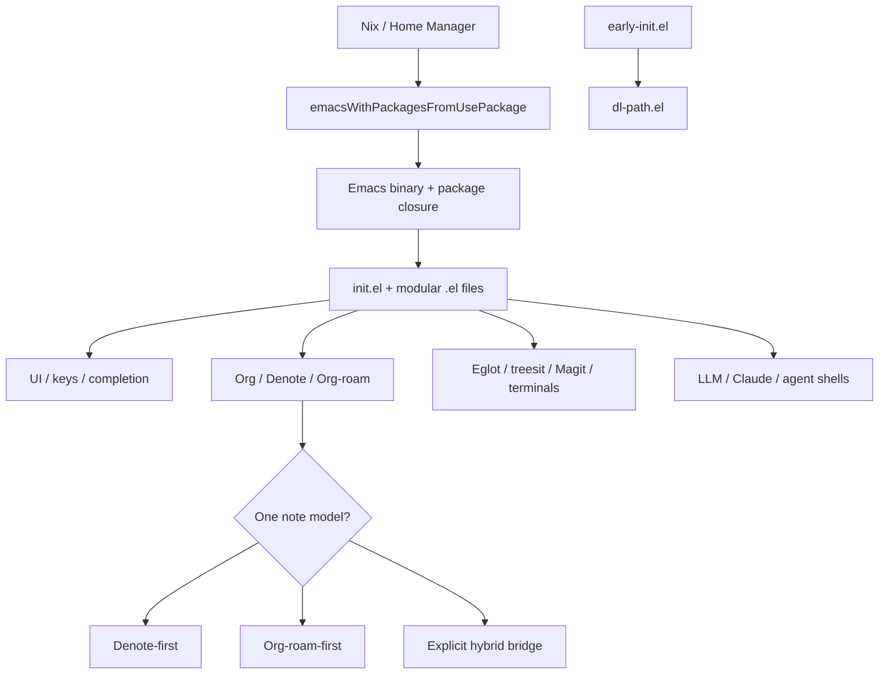

# A Modern Emacs Configuration Guide for Your Nix-Managed emacs.d

## Executive summary

Your current Emacs setup is already much closer to a “modern” architecture than most hand-rolled configs. The strongest parts are its explicit Nix ownership model, modular directory layout, startup-stage separation via `early-init.el`, environment management through `envrc`, a modern completion stack, serious native-compilation care, and a broad workflow surface that already includes Org, Denote, Org-roam, Eglot, Magit, terminals, and AI-adjacent modules. In practical terms, your repo is not starting from scratch; it is at the stage where the highest returns now come from **unifying decisions**, **removing overlaps**, and **tightening operational discipline** rather than adding many more packages. fileciteturn48file0L1-L3 fileciteturn49file0L1-L3 fileciteturn18file0L1-L3 fileciteturn19file0L1-L3 fileciteturn46file0L1-L3

The single most important architectural recommendation is to keep **Nix as the package source of truth** and treat `use-package` as a declarative configuration layer, not as a second package manager. That matches your existing wrapper around `emacsWithPackagesFromUsePackage`, your disabled runtime archives, and your repo’s own guidance that package changes require tracked files and `home-manager switch`. `use-package` itself explicitly positions itself as a configuration macro rather than a package manager, while `straight.el` explicitly positions itself as a replacement for `package.el`, not for `use-package`. fileciteturn48file0L1-L3 fileciteturn49file0L1-L3 fileciteturn18file0L1-L3 citeturn25view0turn27view0

The biggest medium-term improvements are straightforward. Resolve configuration overlaps and “split-brain” workflows: your note system currently spans plain Org capture, Denote, Org-roam, and a local `denote-roam.el` bridge, but there is no clear single source of truth for note creation and identity; your tree-sitter policy appears in two places with different installation behavior; and `C-c a` is assigned in both your Org and Embark layers, so whichever loads later will win. Those are the kinds of issues that make a mature config feel inconsistent even when all the parts are individually strong. fileciteturn30file0L1-L3 fileciteturn31file0L1-L3 fileciteturn32file0L1-L3 fileciteturn34file0L1-L3 fileciteturn39file0L1-L3 fileciteturn40file0L1-L3 fileciteturn29file0L1-L3

My highest-confidence recommendations for your repo are these:

- Keep `early-init.el` lean and startup-focused, exactly as the Emacs manual recommends; push everything non-essential back into ordinary modules. Your current `early-init.el` is already close to this ideal. fileciteturn18file0L1-L3 citeturn4view0turn4view1
- Treat Nix ownership, `use-package` declarations, and git-tracked files as one coherent build pipeline; do not casually mix Nix ownership with a second runtime package manager. fileciteturn48file0L1-L3 fileciteturn49file0L1-L3 citeturn25view0turn27view0
- Choose a **Denote-first**, **Org-roam-first**, or **explicit hybrid** note architecture. Your current repo suggests all three at once. fileciteturn31file0L1-L3 fileciteturn32file0L1-L3 fileciteturn34file0L1-L3 citeturn15view0turn15view1turn15view2turn15view3turn16view1turn16view2turn16view3
- Fix small but user-visible correctness issues, especially the hard-coded `2026` in your daily/weekly note helpers and the `C-c a` keybinding collision. fileciteturn30file0L1-L3 fileciteturn29file0L1-L3
- Add more discoverability, not more complexity: a generated keybinding reference, in the spirit of `vk`’s generated keybinding document, would suit your Meow-plus-prefix-map style extremely well. fileciteturn17file0L1-L3
- Keep security front-of-mind around Org Babel, local variables, trusted directories, and API keys. Emacs, Org, gptel, and your own repo all point to the same conclusion: trust should be explicit, narrow, and auditable. fileciteturn19file0L1-L3 fileciteturn48file0L1-L3 citeturn14view1turn14view2turn34view3turn32view0turn33view0

## What your repositories reveal

The core of `davidlee/nix-config/.emacs.d` is a disciplined modular tree: `core`, `apps`, `lang`, `lisp`, `editing`, `completion`, `org`, and `dev`. Your Home Manager module builds Emacs by concatenating tracked `.el` files from those directories and feeding them to `emacsWithPackagesFromUsePackage`, while `early-init.el` disables runtime archives and assumes package provision comes from Nix. Your repo’s own agent notes emphasize the same model: git-tracked files matter, `:ensure nil` has teeth, and package changes often require a rebuild rather than just live evaluation. That is not an incidental detail; it is the central constraint around which every good recommendation for this config should be made. fileciteturn49file0L1-L3 fileciteturn18file0L1-L3 fileciteturn48file0L1-L3

The configuration also shows a consistent taste profile. You are using Meow for modal editing, Vertico/Orderless/Corfu/Cape/Consult/Embark for completion and action dispatch, Magit and diff-hl for Git, Eglot and tree-sitter-oriented modes for programming, Apheleia plus EditorConfig plus ws-butler for formatting hygiene, Dirvish and Treemacs for navigation, `eat`/Eshell/VTerm for terminal work, Org + capture for planning, Denote and Org-roam for note systems, and AI-related modules for `claude-code-ide` and `agent-shell`. That combination is firmly in the “modern Emacs” family: it prefers built-in completion infrastructure plus small composable packages over monolithic frameworks. fileciteturn23file0L1-L3 fileciteturn25file0L1-L3 fileciteturn26file0L1-L3 fileciteturn27file0L1-L3 fileciteturn28file0L1-L3 fileciteturn29file0L1-L3 fileciteturn36file0L1-L3 fileciteturn39file0L1-L3 fileciteturn38file0L1-L3 fileciteturn45file0L1-L3 fileciteturn30file0L1-L3 fileciteturn31file0L1-L3 fileciteturn32file0L1-L3 fileciteturn43file0L1-L3 fileciteturn44file0L1-L3

The `davidlee/vk` repo is not an Emacs config, but it is still useful as design evidence. Its generated keybinding reference shows a coherent interaction grammar: modal movement, mnemonic prefixes, `?` for help, `:` for a command palette, and `q` for quick capture. That is exactly the sort of “small command language” that scales well in Emacs too, especially when you already use Meow. In other words, `vk` suggests you prefer **stable, memorable verbs and prefixes** over accidental key accumulation, and your Emacs should lean harder into that principle. fileciteturn17file0L1-L3

A few repo-specific quick tricks are already worth preserving and documenting better:

| Current trick | Why it matters |
|---|---|
| `C-x g` → `magit-status` | Still the fastest “project control room” entrypoint in your setup. fileciteturn36file0L1-L3 |
| `M-s r` and `C-c s g` → `consult-ripgrep` | This is a high-leverage replacement for ad hoc buffer/file search. fileciteturn28file0L1-L3 |
| `C-c n n` / `C-c n l` / `C-c n b` | Denote creation, linking, and backlinks are already one keystroke family. fileciteturn31file0L1-L3 |
| `C-c r f` / `C-c r i` / `C-c r b` | Org-roam find/insert/buffer follows the same “notes prefix” logic. fileciteturn32file0L1-L3 |
| `<s-C-return>` → `eshell-other-window` | Excellent low-friction shell launch habit for knowledge work. fileciteturn45file0L1-L3 |
| `C-c '` → `claude-code-ide-menu` | A clear AI entrypoint is better than sprinkling model calls across random keys. fileciteturn43file0L1-L3 |

## Architecture and modularization

The Emacs manual’s guidance on startup is simple and still correct: only things that truly must happen before package and GUI initialization belong in `early-init.el`; the rest should stay in normal init files. Your repo already aligns with that by keeping `early-init.el` focused on package bootstrap decisions and dispatching the rest of the work to domain modules. That is worth preserving, not disrupting. citeturn4view0turn4view1 fileciteturn18file0L1-L3

Your actual architecture is best understood as a three-layer system:



That diagram implies a practical rule: keep each layer’s ownership unambiguous. Nix owns package availability and system integration. `use-package` owns activation, hooks, and keybindings. Your `.el` modules own user experience. And if you adopt literate configuration with Org/Babel, the tangled `.el` output should still be the build artifact that Nix actually consumes, because your current `emacs.nix` explicitly reads tracked `.el` files under listed config dirs. A purely runtime literate approach would undermine the reproducibility guarantees your repo is otherwise built around. fileciteturn49file0L1-L3 fileciteturn48file0L1-L3 citeturn14view3turn14view1

A representative repo pattern that is absolutely worth keeping is your native-comp append-only strategy:

```elisp
(require 'comp)
(setq native-comp-driver-options
      (append native-comp-driver-options
              '("-Wl,-O2" "-Wl,--as-needed")))
```

That is the right shape for your Nix build because your repo notes explicitly warn that overwriting preloaded native-comp driver options breaks linking in this environment. The broader best practice is: **append to startup-critical Nix-populated variables; do not reset them casually in user config**. fileciteturn46file0L1-L3 fileciteturn48file0L1-L3 citeturn4view2

A second excellent pattern is your `my/expand-emacs-dir` helper, which uses `abbreviate-file-name` before trusting local code. That is not just neat Lisp; it is defensive configuration engineering. The repo notes explain why the `~/`-abbreviated path matters for `trusted-content` matching, and your current module only trusts your own code directories, not external checkouts. For a long-lived Emacs configuration, that is exactly the kind of small correctness detail that prevents mysterious security or loading issues later. fileciteturn19file0L1-L3 fileciteturn48file0L1-L3

Here is the package-management and modularization comparison that best fits your situation:

| Choice | Best fit | Why | Trade-offs |
|---|---|---|---|
| **Nix + modular `.el` + `use-package`** | **Best for your current repo** | Matches your existing `emacsWithPackagesFromUsePackage`, disabled runtime archives, tracked-file discipline, and Home Manager workflow. fileciteturn49file0L1-L3 fileciteturn18file0L1-L3 fileciteturn48file0L1-L3 | Slower iteration for new packages; package additions are build events, not just editor events. fileciteturn48file0L1-L3 |
| **`straight.el` + `use-package`** | Best only if you want package pinning and experimentation outside Nix | `straight.el` emphasizes reproducibility, Git-based package sources, lockfiles, and `use-package` integration. citeturn27view0turn25view0 | Adds a second package-ownership model that conflicts with the spirit of your Nix setup unless you draw hard ownership boundaries. This is an inference from the docs plus your repo model. citeturn27view0turn25view0 fileciteturn49file0L1-L3 |
| **Literate Org that tangles to tracked `.el`** | Best if you want narrative documentation without losing reproducibility | Org/Babel gives you code blocks, tangling, header args, and literate-programming workflows in one document. citeturn14view3turn14view1 | In your repo, the tangled `.el` must remain the build artifact Nix sees; runtime-only evaluation is the wrong abstraction. fileciteturn49file0L1-L3 fileciteturn48file0L1-L3 |

## Package and workflow choices

Your completion stack is already pointed in the right direction. Vertico’s own documentation positions it as a minimal and fully compatible minibuffer UI; Orderless supplies flexible component matching; Corfu provides a small in-buffer completion popup over the standard `completion-at-point` pathway; Consult adds search and navigation commands with preview; and Marginalia is specifically recommended as a companion for richer annotations. Your repo reflects almost all of that architecture already. In other words, the right move here is not a dramatic switch to a monolithic framework; it is polishing and simplifying the modern stack you already chose. citeturn20view4turn20view0turn20view1turn20view2turn21view0 fileciteturn25file0L1-L3 fileciteturn26file0L1-L3 fileciteturn27file0L1-L3 fileciteturn28file0L1-L3 fileciteturn29file0L1-L3

For notes, the strongest recommendation is to decide consciously between three valid but different models. Denote is optimized around stable, descriptive filenames, controlled vocabulary, and low-tech interoperability; Org-roam is optimized around link-centric discovery, capture templates, a database, a side buffer, and completion everywhere; a hybrid can work, but only if you deliberately define how filenames, IDs, backlinks, and capture targets interact. Your repo currently contains evidence of all three models at once: plain Org capture and agenda files, Denote setup, Org-roam setup, and a local `denote-roam.el` bridge. That is powerful, but it is also where long-term entropy will accumulate. citeturn15view0turn15view1turn15view2turn15view3turn16view1turn16view2turn16view3 fileciteturn30file0L1-L3 fileciteturn31file0L1-L3 fileciteturn32file0L1-L3 fileciteturn34file0L1-L3

For AI integration, the package ecosystem is now mature enough that you should separate **chat**, **inline code completion**, **provider abstraction**, and **tool-use/agent workflows** instead of expecting one package to do everything elegantly. `gptel` is the best fit for flexible, buffer-native chat and editing workflows; `copilot.el` is the strongest fit for ghost-text coding assistance; the `llm` library is valuable when you want provider abstraction inside other packages; and your existing `claude-code-ide` module suggests you are also interested in CLI-backed agent workflows, especially through terminals. That separation of concerns will keep your AI layer from turning into a knot. citeturn32view0turn33view0turn33view2turn33view3 fileciteturn43file0L1-L3 fileciteturn44file0L1-L3

Here are the highest-value comparisons for your setup:

| Domain | Choice | Strengths | Weaknesses | Recommendation |
|---|---|---|---|---|
| Notes | **Denote** | Predictable filenames, controlled vocabulary, Org-capture support, strong long-term portability, and explicit evidence of scale tolerance. citeturn15view0turn15view1turn15view2turn15view3 | Weaker graph/discovery ergonomics unless supplemented. | Best if you want durable plain-file PKM and grep-friendly notes. |
| Notes | **Org-roam** | Rich node discovery, autosync DB, link completion everywhere, powerful templating, backlinks buffer. citeturn16view1turn16view2turn16view3 | More moving parts, database overhead, capture model divergence from standard Org capture. | Best if you want networked notes and backlink-driven exploration. |
| Notes | **Explicit hybrid** | Can combine Denote filenames with Org-roam IDs/backlinks; your repo already contains a custom bridge. fileciteturn34file0L1-L3 | Highest configuration complexity and easiest way to create duplicate note-identity systems. | Only choose this if you are willing to define and document the rules. |
| AI | **gptel** | Multi-backend, any-buffer workflow, tool use, MCP integration, introspection, save chats as normal files. citeturn32view0 | Better at general interaction than deeply opinionated coding UX. | Best default chat/editor AI layer for Emacs. |
| AI | **Copilot.el** | Inline completions, chat, next-edit suggestions, official Copilot language server integration. citeturn33view2turn33view3 | Requires Copilot access and Node 22+; more proprietary service coupling. | Best for code-completion acceleration, not general knowledge work. |
| AI | **`llm`-based packages** | Provider abstraction, chat/media/tool-use primitives, embedding support, secure key-handling patterns. citeturn33view0 | Usually a foundation for other packages, not an end-user workflow by itself. | Best when you want your own composable LLM tooling. |
| Nix LSP | **`nil`** | Established Nix language server with an explicit Eglot setup that matches your repo’s current `eglot-server-programs`. citeturn31view0 fileciteturn41file0L1-L3 | Less ambitious feature set than `nixd`. | Best if you want to stay close to your current config. |
| Nix LSP | **`nixd`** | Feature-rich server with option support, package completion, shared eval caches, and cross-file analysis across nixpkgs. citeturn30view2turn30view3 | Different operational profile from `nil`; migration takes deliberate testing. | Best if Nix authoring is central enough to justify the switch. |

One concrete improvement to your current stack is to add Marginalia unless you intentionally prefer a plainer minibuffer. Its own docs recommend it alongside Vertico and Consult, and your current stack is already in that exact ecosystem. Another high-value improvement is to formalize a small number of prefix maps instead of letting related commands sprawl across globals and Meow bindings. `vk`’s generated keybinding grammar is a strong clue that this will fit how you think. citeturn21view0turn20view4turn20view2 fileciteturn17file0L1-L3

## Domain-specific recommendations

For programming, your existing Eglot + tree-sitter + Apheleia + terminal combination is very solid. The main refinement I would make is not adding more language tooling but removing ambiguity: right now `treesit-auto` is configured both with `treesit-auto-install 'prompt` in `dl-eglot.el` and with `treesit-auto-install nil` in `dl-treesit.el`. If both modules are active, you have two contradictory policies for grammar installation. Pick one policy and keep it in one place. Similarly, your Nix support currently points Eglot at `nil`; that is fine, but if Nix becomes a first-class language for you, `nixd` is a credible upgrade path because it explicitly advertises options support, package completion, shared eval caches, and cross-file analysis. fileciteturn39file0L1-L3 fileciteturn40file0L1-L3 fileciteturn41file0L1-L3 citeturn31view0turn30view2turn30view3

For prose, the foundations are already there: browser-text editing via `atomic-chrome`, a local dictionary server, your `inflow`-based paragraph fill binding, whitespace cleanup, EditorConfig, and global formatting support. That is a good base for writing, review, and web-first prose workflows. My recommendation is to make prose its own layer conceptually: lightweight insertion and reflow tools in text modes, heavier formatting only where it is clearly safe, and capture/export workflows that keep task metadata separate from narrative text. Your Org setup is already close to that boundary because it keeps agenda files and capture templates distinct from the rest of the editor. fileciteturn20file0L1-L3 fileciteturn37file0L1-L3 fileciteturn38file0L1-L3 fileciteturn30file0L1-L3

For Org itself, the most immediate repo-specific fix is the hard-coded `2026` directory in your `my/daily-note` and `my/weekly-note` helpers. That should be computed from the current date, not embedded in the function, or your calendar workflow will silently “age out.” The second fix is to review your `org-modern` declaration, because as written it looks structurally questionable for `use-package`; even if it currently happens to work through macro expansion quirks or load order, it is not very legible. The third fix is strategic: decide whether Org capture is the front door for your note system, or whether Denote/Org-roam capture functions are. At the moment, all three are present. fileciteturn30file0L1-L3 fileciteturn31file0L1-L3 fileciteturn32file0L1-L3

A minimal corrective refactor for the daily-note helper would look like this:

```elisp
(defun my/daily-note ()
  "Open today's plain Org daily note."
  (interactive)
  (let* ((year (format-time-string "%Y"))
         (dir  (expand-file-name year org-directory))
         (file (expand-file-name
                (format-time-string "%Y-%m-%d.org")
                dir)))
    (make-directory dir t)
    (find-file file)
    (when (= (point-max) 1)
      (insert "#+title: " (format-time-string "%Y-%m-%d %A") "\n")
      (insert "#+filetags: :journal:\n\n")
      (insert "* Tasks\n\n* Notes\n\n* Log\n"))))
```

This is directly adapting your existing helper while removing the year trap. fileciteturn30file0L1-L3

For Git, your Magit layer is intentionally light: `magit-status`, `diff-hl`, `git-modes`, `transient`, and commit-message support. That is sensible. Magit itself explicitly presents itself as a Git porcelain, and its ecosystem already gives you a reusable menu grammar through Transient. The best advanced move here is not more Git package sprawl; it is to use Magit/Transient as a pattern language for your own project commands, release workflows, and note-capture actions. If you want deeper forge awareness later, Magit’s own docs point to Forge for issue and PR workflows. fileciteturn36file0L1-L3 citeturn11view0turn12view0turn12view1turn12view2

For AI, I recommend an intentionally split workflow. Use `gptel` for chat, rewriting, note summarization, and ad hoc research buffers because it is backend-flexible, supports tool use and MCP, and stores conversations as regular files. Use Copilot only where you want inline code acceleration. Use your `claude-code-ide` module for terminal-backed, project-scoped coding interactions if that CLI-centric style works well for you. And if you build your own tools, define them on top of `llm` or `gptel` rather than hard-coding one provider everywhere. That gives you an “AI layer” that is powerful without being vendor-locked inside your own Emacs Lisp. citeturn32view0turn33view0turn33view2turn33view3 fileciteturn43file0L1-L3

## Security, testing, and migration

Security in Emacs is often about mundane things rather than dramatic exploits. The Emacs manual is explicit that file-local and directory-local variables can be dangerous, especially `eval` and `load-path`, and it explains the trust model around safe local variables and trusted directories. Your own repo adds a second important layer through `trusted-content`: it deliberately trusts only your own Lisp directories and avoids trusting external checkouts. Org adds a third layer of concern because source blocks can execute code during ordinary editing or export, and its manual explicitly recommends relying on trusted sources and confirmation controls such as `org-confirm-babel-evaluate` and `:eval never-export`. Those three pieces fit together into one policy: **narrow trust, avoid ambient execution, and make exceptions explicit**. citeturn34view1turn34view2turn34view3turn14view1turn14view2 fileciteturn19file0L1-L3 fileciteturn48file0L1-L3

For AI credentials, both gptel and `llm` make the same practical recommendation: store secrets outside the repo and retrieve them through `authinfo`/`authinfo.gpg` or environment variables. Your repo’s AI modules currently point to a local Claude CLI path, which is already a better pattern than burying API material in tracked config. The future-proof version of this is simple: use `auth-source` or environment-based injection for hosted providers, keep local-model and local-CLI workflows separate, and never commit keys or bearer tokens into `custom-vars.el`, literate config documents, or project-local files. citeturn32view0turn33view0 fileciteturn43file0L1-L3

On testing and debugging, your own repo is unusually helpful because it already documents the real operational traps. New package declarations require rebuilds. New files must be git-tracked. Native-comp cache corruption can leave behind junk temporary files. External introspection through `emacsclient --eval` is part of the normal debugging workflow. That means the right testing culture for this repo is: keep modules small, evaluate locally when only Lisp behavior changed, rebuild when package closure changed, and maintain a short startup smoke-test checklist after any structural refactor. That is much more aligned with your Nix-backed setup than generic package-manager advice. fileciteturn48file0L1-L3

The migration path I would recommend has three phases. First, remove conflicts without changing your worldview: fix the `C-c a` collision, the hard-coded note year, and the duplicated tree-sitter policy. Second, choose your notes architecture: Denote-first, Org-roam-first, or an explicit bridge. Third, if you want literate configuration, introduce it only as a documentation layer that tangles to tracked `.el` files inside the existing modular tree. That phase ordering keeps visible wins early and avoids mixing three migrations at once. The reasoning here is an inference from your repo structure, Org’s literate features, and your existing build pipeline. fileciteturn29file0L1-L3 fileciteturn30file0L1-L3 fileciteturn39file0L1-L3 fileciteturn40file0L1-L3 fileciteturn49file0L1-L3 citeturn14view3turn14view1

A final creative suggestion: copy the spirit of `vk`’s generated keybinding reference into your Emacs workflow. You already have comments in `dl-keybind.el` pointing to `describe-keymap`, `which-key-show-keymap`, and related commands; `vk` goes one step further by turning key definitions into generated documentation. Doing something similar for your prefix maps would make your config easier to evolve, easier to audit, and far easier to re-learn six months from now. fileciteturn22file0L1-L3 fileciteturn17file0L1-L3

## Assumptions and gaps

I assumed that the selected GitHub repos reflect the active intent of your setup, but not necessarily every locally untracked file or private secret module; your repo notes explicitly say some files are intentionally untracked, so there may be effective behavior not visible here. fileciteturn48file0L1-L3

I also assumed that you want to keep the current Nix/Home Manager ownership model rather than replace it with `straight.el` or a runtime package manager. That assumption is strongly supported by `early-init.el`, `emacs.nix`, and the repo’s agent notes, but if you want to move away from Nix ownership then some recommendations above would change materially. fileciteturn18file0L1-L3 fileciteturn49file0L1-L3 fileciteturn48file0L1-L3

There are a few clear gaps. I did not verify your actual load order for every optional module in `init.el`, so when I identify collisions such as `C-c a` or duplicate `treesit-auto` policy, I am describing **real conflicts if both modules are loaded**, not claiming that both are definitely active in your running session. I also did not benchmark startup time on your machine or inspect untracked/private AI credentials and helper files, so performance and secret-management recommendations are necessarily architectural rather than machine-specific. fileciteturn29file0L1-L3 fileciteturn30file0L1-L3 fileciteturn39file0L1-L3 fileciteturn40file0L1-L3

Overall, though, the evidence is strong enough for a confident conclusion: your Emacs is already modern in the ways that matter most. The path forward is not more accumulation. It is clarification, consolidation, and sharper boundaries. fileciteturn48file0L1-L3 fileciteturn49file0L1-L3
